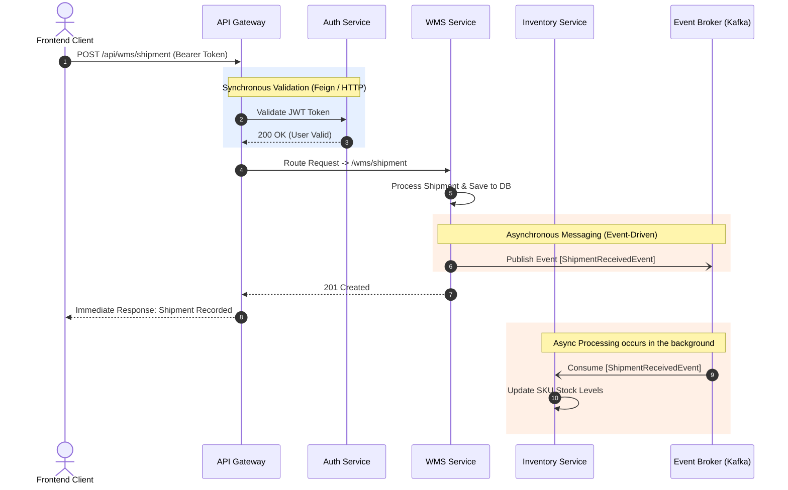

# Service Communication

This document details how the microservices within our platform communicate with each other. In a distributed environment, choosing the right method of communication (synchronous vs. asynchronous) is vital for maintaining high performance line stability.

:::warning
*Note for Developers*: Based on the current version of the codebase, explicit inter-service communication (via Feign or Kafka) is **not yet implemented**. The patterns detailed below outline the **intended architectural design** for when distributed actions are necessary.
:::

## Overview of Communication Patterns

1. **External Traffic**: External requests always enter the system through the **API Gateway** (`spring-cloud-starter-gateway`), which dynamically routes to the appropriate business service using the Netflix **Eureka Discovery Client**.
2. **Synchronous Internal Calls**: Represented by direct HTTP requests when an immediate response is required (e.g., retrieving user details from the `auth-service`).
3. **Asynchronous Messaging**: Event-driven architecture used for fire-and-forget processes, minimizing coupling and improving system resilience.

## Typical Flow: WMS -> Inventory Processing 

The sequence diagram below demonstrates a hypothetical multi-step business process—such as a new shipment arriving at the warehouse (WMS) that requires the Inventory system to update its stock.

### 1. Synchronous Communication (Spring Cloud OpenFeign)

For operations where a service *must* wait for an immediate response to proceed, we utilize declarative REST clients via **OpenFeign**. 

**Use Cases**:
- Validating a user session token.
- Checking real-time account balances or limits before completing an action.

**Pros**: Simple to track the control flow, immediate consistency.
**Cons**: Creates tight coupling and potential bottlenecks if the downstream service is slow or unavailable.

### 2. Asynchronous Communication (Apache Kafka)

For operations where immediate consistency is not strictly required, we use an event-driven approach via an event broker like **Apache Kafka**.

**Use Cases**:
- Updating inventory after a WMS transaction is completed.
- Sending out email notifications upon company registration completion.
- Replicating read-heavy domain data to other services.

**Pros**: High throughput, loose coupling, allows upstream services to respond to the end-user faster without waiting for subsequent side-effects to conclude.
**Cons**: Eventual consistency model requires more complex error handling (e.g., dead letter queues and compensating transactions).
