# System Overview

This document provides a high-level architectural view of the system using the **C4 Model** (System Context & Container diagrams) to illustrate how the various Spring Boot microservices interact with actors and external systems.

## C4 Model: Container Diagram

The following Mermaid diagram represents the Container level of our architecture, showcasing the API Gateway, Discovery Server, business microservices, and external dependencies.

```mermaid
C4Context
  title System Context & Container Diagram for Ops Platform

  Person(user, "Platform User", "A user interacting with the frontend web application.")

  System_Boundary(ops_platform, "Ops Microservices Platform") {
    Container(frontend, "Frontend App", "Angular / Web", "Provides the user interface (ops-fe).")
    
    Container(api_gateway, "API Gateway", "Spring Cloud Gateway", "Routes incoming requests to appropriate microservices.")
    Container(eureka, "Service Registry", "Spring Cloud Netflix Eureka", "Handles dynamic discovery of all microservices.")
    
    Container(auth_service, "Auth Service", "Spring Boot", "Handles user authentication and authorization.")
    Container(common_service, "Common Service", "Spring Boot", "Provides shared utilities and common domain data.")
    Container(company_reg, "Company Registration", "Spring Boot", "Manages onboarding and registration of companies.")
    Container(inventory_service, "Inventory Service", "Spring Boot", "Tracks and manages inventory records.")
    Container(vehicle_service, "Vehicle Service", "Spring Boot", "Manages the vehicle fleet and logistics data.")
    Container(wms_service, "WMS Service", "Spring Boot", "Warehouse Management System operations.")
    Container(it_device, "IT Device Mgmt", "Spring Boot", "Tracks and manages internal IT devices.")
    Container(efs_service, "EFS Service", "Spring Boot", "Enterprise File/Form System service.")
  }

  System_Ext(sqlserver, "Microsoft SQL Server", "Stores business data and state for microservices.")
  System_Ext(ldap, "Active Directory / LDAP", "External identity provider for corporate user authentication.")

  Rel(user, frontend, "Uses", "HTTPS")
  Rel(frontend, api_gateway, "Makes API calls to", "JSON/REST")
  
  Rel(api_gateway, eureka, "Discovers services via", "REST")
  Rel(api_gateway, auth_service, "Routes authentication requests to", "REST")
  Rel(api_gateway, wms_service, "Routes WMS requests to", "REST")
  Rel(api_gateway, inventory_service, "Routes Inventory requests to", "REST")
  
  Rel(auth_service, ldap, "Validates credentials against", "LDAP")
  Rel(auth_service, sqlserver, "Reads/Writes user metadata", "JDBC")
  Rel(inventory_service, sqlserver, "Reads/Writes inventory data", "JDBC")
  Rel(wms_service, sqlserver, "Reads/Writes WMS data", "JDBC")
  Rel(vehicle_service, sqlserver, "Reads/Writes logistics data", "JDBC")
```

:::info
In our current architecture, all business microservices register themselves with the **Eureka Server** on startup. The **API Gateway** periodically fetches this registry to route incoming frontend traffic dynamically.
:::

## Service Roles

Here is a breakdown of the responsibilities for each core component in the system.

- **`eureka-server`**: Acts as the central Service Registry. It keeps track of the active instances of all microservices, allowing them to find and communicate with each other dynamically without hardcoded IP addresses.
- **`api-gateway`**: the single entry point for all external traffic (from the `ops-fe` frontend). It handles routing, load balancing, and potentially cross-cutting concerns like CORS and global authentication checks.
- **`auth-service`**: Dedicated to security. It interfaces with an external LDAP server for corporate credential validation and issues authentication tokens (e.g., JWTs) for session management.
- **`common-service`**: A shared module/service meant to handle generic business logic or configuration data utilized by multiple domains.
- **`company-registration-service`**: Manages the domain logic for onboarding new tenant companies into the platform.
- **`inventory-service`**: Manages stock levels, SKUs, and inventory tracking for warehouse operations.
- **`vehicle-service`**: Handles the transportation and logistics side of operations, keeping track of enterprise vehicles.
- **`wms-service`**: The core Warehouse Management System, dealing with inbound/outbound shipments and storage allocation.
- **`it-device-management-service`**: An internal tracking service for managing company-owned laptops, phones, and peripheral IT equipment.
- **`efs-service`**: Likely serves electronic forms or file system integrations for workflow approvals or document storage. 
