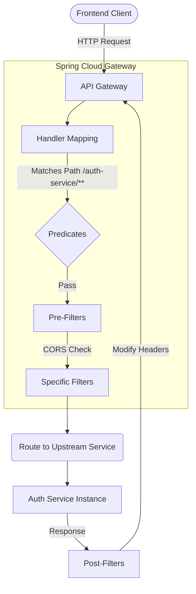

# API Gateway

The **API Gateway** serves as the single entry point for all client requests (e.g., from `ops-fe`), routing them to the appropriate backend microservices. Built on **Spring Cloud Gateway**, it provides an effective way to route APIs and apply cross-cutting concerns like security, monitoring, and resiliency.

## Role of Spring Cloud Gateway

In a distributed microservice architecture, exposing every individual service directly to the outside world creates tight coupling and security risks. The API Gateway solves this by:
1. **Dynamic Routing**: Mapping frontend paths to corresponding backend services dynamically using Eureka.
2. **Security & Filtering**: Applying global filters (like stripping/modifying headers, CORS, or JWT validation blockages).
3. **Load Balancing**: Distributing requests across multiple instances of the same service.
4. **API Documentation Aggregation**: Gathering Swagger/OpenAPI docs from all underlying services into one UI.

## Gateway Flow

The diagram below illustrates how a request from the frontend is evaluated, filtered, and routed by the gateway.



## Technical Specifications

| Property | Value |
| :--- | :--- |
| **Default Port** | `8080` |
| **Framework** | Spring Cloud (`spring-cloud-starter-gateway`) |
| **Service Discovery** | Eureka Client Enabled |
| **Health Check URL** | `/actuator/health` |

## Routing Configuration

Unlike standard static routing inside `spring.cloud.gateway.routes`, this project defines a custom routing schema mapping under an `app.routing` property block. This indicates the project builds the gateway routes programmatically via a Java `RouteLocator` Bean using properties from `application-dev.yml`.

### YAML Setup

```yaml title="application-dev.yml"
app:
  routing:
    # Standard REST Endpoint Routing
    rest-services:
      - auth-service
      - vehicle-service
      - common-service
      - inventory-service
      - wms-service
      - company-registration-service
      - efs-service
      - it-device-management-service

    # Dedicated WebSocket Routing
    websocket-services:
      - service-id: vehicle-service
        path-prefix: /vehicle-service/ws
      - service-id: efs-service
        path-prefix: /efs-service/ws

spring:
  cloud:
    gateway:
      default-filters:
        # Prevents duplicate CORS headers on the response
        - DedupeResponseHeader=Access-Control-Allow-Origin Access-Control-Allow-Credentials, RETAIN_UNIQUE
```

### Configured Routes Overview

Based on the configuration above, the Gateway manages routes for the following registered services (with dynamic predicates automatically mirroring the service names):

- **REST Routes**:
  - `/auth-service/**` $\rightarrow$ `auth-service`
  - `/vehicle-service/**` $\rightarrow$ `vehicle-service`
  - `/common-service/**` $\rightarrow$ `common-service`
  - `/inventory-service/**` $\rightarrow$ `inventory-service`
  - `/wms-service/**` $\rightarrow$ `wms-service`
  - `/company-registration-service/**` $\rightarrow$ `company-registration-service`
  - `/efs-service/**` $\rightarrow$ `efs-service`
  - `/it-device-management-service/**` $\rightarrow$ `it-device-management-service`

- **WebSocket Routes**:
  - `ws://<gateway-ip>/vehicle-service/ws/**` $\rightarrow$ `vehicle-service`
  - `ws://<gateway-ip>/efs-service/ws/**` $\rightarrow$ `efs-service`

:::tip
Global cross-origin issues are managed heavily at the Gateway level using the `DedupeResponseHeader` filter to ensure browsers don't reject duplicate `Access-Control-Allow-Origin` values returning from downstream services.
:::
