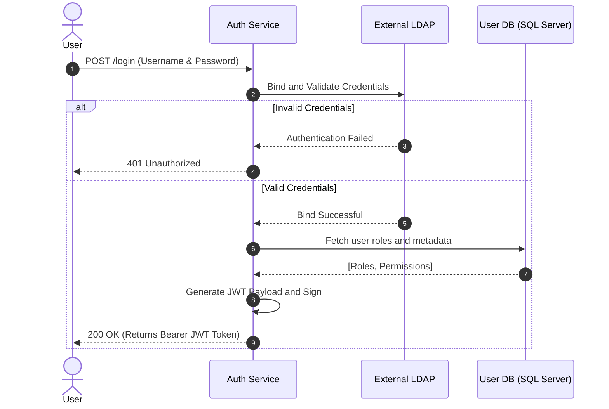

# Auth Service

The **Auth Service** is responsible for validating corporate credentials and issuing secure tokens to authorize access across the microservices ecosystem. 

## Security Mechanism

This service employs a hybrid security approach:
- **Authentication**: Validates credentials against an external **LDAP / Active Directory** server.
- **Authorization / Session**: Issues stateless **JSON Web Tokens (JWT)** once the user is authenticated.

:::tip
By using stateless JWTs instead of HTTP sessions, the platform remains highly scalable. Downstream services do not need to call the Auth Service directly on every request; they can simply verify the JWT's signature.
:::

## Authentication Flow

Below is the standard sequence for a user initially logging into the platform:



## Technical Specifications

| Property | Value |
| :--- | :--- |
| **Default Port** | `8081` |
| **Framework** | Spring Boot (`spring-boot-starter-web`) |
| **Database** | Microsoft SQL Server |
| **Health Check URL** | `/actuator/health` |

## Security Dependencies

The service heavily utilizes the Spring Security ecosystem alongside external JWT and LDAP libraries.

```xml title="pom.xml (Security Snapshot)"
<!-- Core Spring Security -->
<dependency>
    <groupId>org.springframework.boot</groupId>
    <artifactId>spring-boot-starter-security</artifactId>
</dependency>

<!-- LDAP Integration -->
<dependency>
    <groupId>org.springframework.ldap</groupId>
    <artifactId>spring-ldap-core</artifactId>
</dependency>
<dependency>
    <groupId>org.springframework.security</groupId>
    <artifactId>spring-security-ldap</artifactId>
</dependency>
<dependency>
    <groupId>com.unboundid</groupId>
    <artifactId>unboundid-ldapsdk</artifactId>
</dependency>

<!-- JSON Web Token (JJWT) -->
<dependency>
    <groupId>io.jsonwebtoken</groupId>
    <artifactId>jjwt-api</artifactId>
    <version>0.12.6</version>
</dependency>
```

:::warning
Ensure that the secret key used to sign the JWTs is long enough (at least 256 bits for HS256, though 512 bits is recommended) and securely stored in environment variables, never hardcoded in the properties file.
:::
