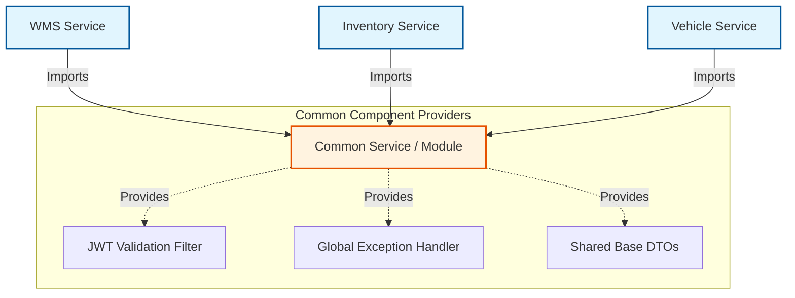

# Common Service

The **Common Service** is uniquely positioned not just as a standalone microservice, but essentially as a **shared library/utility module**. It houses generic logic, cross-cutting configurations, and shared domains that other microservices depend on to prevent code duplication.

## Role & Purpose

While it can run as an independent Spring Boot application (on port `8082`), its primary strength lies in providing centralized utilities. 

### Key Shared Components
Based on its dependencies and structure, the common service provides:
1. **Security & JWT Parsing**: Contains the `jjwt` dependencies and `spring-boot-starter-security` to provide shared filters that upstream services can use to process and validate JWTs.
2. **Global Exception Handling**: Likely houses `@ControllerAdvice` classes to ensure standardized error responses (e.g., standardizing 400 Bad Request or 404 Not Found JSON formats).
3. **Data Transfer Objects (DTOs)**: Shared Request and Response envelopes used uniformly across the platform.
4. **Validation and AOP**: Features `spring-boot-starter-aop` for aspect-oriented logging or performance tracking, and `spring-boot-starter-validation` for shared constraint annotations.
5. **Utility Classes**: Uses libraries like `commons-lang3`, `commons-math3`, and `commons-text` for string manipulation, math operations, and object handling.

## Architectural Flow



## Technical Specifications

| Property | Value |
| :--- | :--- |
| **Default Port** | `8082` |
| **Actuator Endpoints** | `health`, `info`, `metrics` |
| **Health Check URL** | `/actuator/health` |

## Maven Inclusion

If you are creating a new microservice in the `ops` ecosystem and need access to the core platform utilities, include the `common-service` module as a dependency in your `pom.xml`:

```xml title="pom.xml"
<dependency>
    <groupId>com.uni</groupId>
    <artifactId>common-service</artifactId>
    <version>${project.version}</version>
</dependency>
```

:::info
Make sure your new Spring Boot application is configured to scan the packages within `com.uni.common_service` if you want Spring to auto-detect its embedded `@Component` or `@Configuration` classes!
:::
