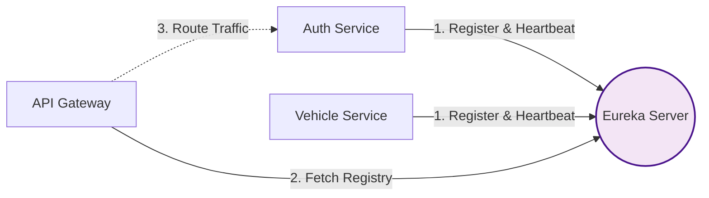

# Eureka Server

The **Eureka Server** is the backbone of the platform's distributed architecture. Built on Spring Cloud Netflix Eureka, it acts as the centralized **Service Registry**, allowing all other microservices to find and communicate with each other dynamically.

## Service Discovery Pattern

In a cloud-native or containerized environment (like Docker Compose or Kubernetes), hardcoding IP addresses for internal service communication is extremely fragile. Containers spin up and down, and IPs change constantly. 

**How it works:**
1. **Registration**: When a microservice (e.g., `auth-service`) starts up, it sends its metadata (IP, Port, Health check URL) to the Eureka Server.
2. **Heartbeat**: The microservice continuously pings Eureka to prove it is still alive. 
3. **Discovery**: When the `api-gateway` needs to route traffic to `auth-service`, it asks Eureka where `auth-service` is currently located. Eureka returns the live addressing information.



## Technical Specifications

| Property | Value |
| :--- | :--- |
| **Default Port** | `8761` |
| **Dashboard URL** | `http://localhost:8761/` |
| **Dependency** | `spring-cloud-starter-netflix-eureka-server` |

:::tip
Accessing the **Eureka Dashboard URL** from your browser will show you an interface listing all actively registered microservice instances, their status (e.g., `UP (1)`), and their current machine addresses.
:::

## Client Configuration

For a new microservice to join the ecosystem and register itself with this server, it needs two things:

1. **The Dependency**:
   ```xml title="pom.xml"
   <dependency>
       <groupId>org.springframework.cloud</groupId>
       <artifactId>spring-cloud-starter-netflix-eureka-client</artifactId>
   </dependency>
   ```

2. **The YAML Configuration**:
   The client service must point to the Eureka server's default zone URL using `application.yml`:

   ```yaml title="application.yml"
   eureka:
     client:
       register-with-eureka: true
       fetch-registry: true
       serviceUrl:
         # In Docker Compose, 'eureka-server' resolves to the container running port 8761
         defaultZone: http://eureka-server:8761/eureka/
     instance:
       prefer-ip-address: true
   ```

:::info
By utilizing `prefer-ip-address: true`, we ensure the client registers its actual network IP rather than its container hostname, which is crucial for cross-container routing via the API Gateway.
:::
