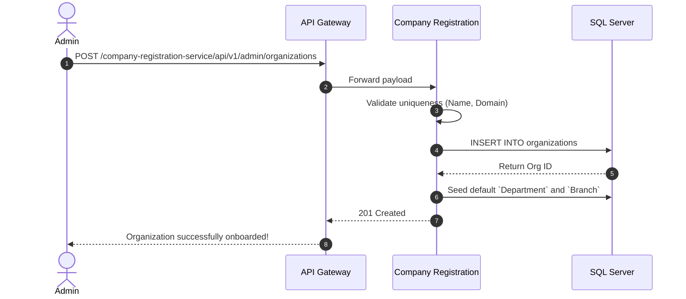

# Company Registration Service

## Overview
The **Company Registration Service** is responsible for managing enterprise tenant/organization onboarding, structural departments, and visitor access logs. It serves as the foundation for multi-tenant data segmentation.

## Tech Stack & Ports

| Technology/Category | Detail |
| :--- | :--- |
| **Framework** | Spring Boot |
| **Primary Database** | Microsoft SQL Server |
| **Default Port** | `8086` |
| **Data Access** | Spring Data JPA / Hibernate |

## Database Schema

Key tables and domain models used to manage organizational structures:

1. **`Organizations` / `OrganizationsTranslations`**: Stores root-level tenant companies and localized data.
2. **`Department` & `Branch`**: Represents the hierarchical structure within a registered organization.
3. **`Visitor` & `WorkLogs`**: Tracks external visitors and temporary access logs to physical company premises.
4. **`UserInformation` & `Role`**: Links corporate users to their respective organizations and modules.

## Key API Endpoints

Using the generic `@BaseApiV1RestController` interface along with specific Admin and Shared controllers:

| Method | Path | Description |
| :--- | :--- | :--- |
| `POST` | `/api/v1/admin/organizations` | Register a new tenant organization. |
| `GET` | `/api/v1/shared/departments` | Fetch the department tree for the current user's organization. |
| `POST` | `/api/v1/admin/visitors` | Log a new visitor entry at a company branch. |
| `GET` | `/api/v1/security/visitor_change` | Fetch the audit log of visitor access changes. |

## Inter-service Interactions

:::info
**Current State**: OpenFeign and messaging queues (e.g., Kafka/RabbitMQ) are **not currently utilized**.
:::

- **Synchronous**: REST calls strictly enter via the Gateway; services do not synchronously block waiting on each other.
- **Asynchronous**: Registration events currently do not publish to a broker. All states are stored directly in SQL Server.

## Business Flow: Onboarding a New Company

