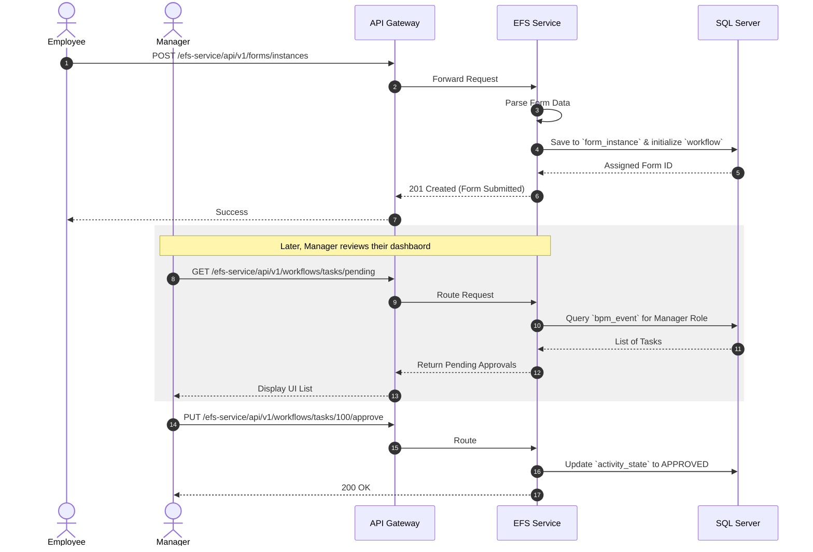

# EFS Service (Electronic Form System)

## Overview
The **EFS Service** serves as the primary Workflow and Electronic Form System engine. It dynamically manages business process modeling (BPM), form definitions, employee approvals, and digital document routing.

## Tech Stack & Ports

| Technology/Category | Detail |
| :--- | :--- |
| **Framework** | Spring Boot (`spring-boot-starter-web`) |
| **Primary Database** | Microsoft SQL Server |
| **Default Port** | `8087` |
| **Workflow Engine** | Custom BPM / Forms Implementation |

## Database Schema

With a highly complex underlying schema, the core entities focus on Business Process modeling:

1. **`FormDefinition` & `FormInstance`**: Defines the dynamic layout/fields of an electronic form and stores actual submitted values.
2. **`Workflow` & `ActivityDefinition`**: Dictates the steps an approval process must take.
3. **`BpmEvent` & `BpmGateway`**: Tracks where an approval ticket is currently sitting in the pipeline.
4. **`Draft` / `DraftHeader`**: Intermediary tables for saving uncompleted forms.

## Key API Endpoints

Similar to the other domains, `efs-service` defines controllers using the custom `@BaseApiV1RestController`.

| Method | Path | Description |
| :--- | :--- | :--- |
| `GET` | `/api/v1/forms/definitions` | Fetch all available blank electronic form templates. |
| `POST` | `/api/v1/forms/instances` | Submit a filled electronic form to begin a workflow. |
| `GET` | `/api/v1/workflows/tasks/pending` | Retrieve all forms awaiting the current user's approval. |
| `PUT` | `/api/v1/workflows/tasks/{taskId}/approve` | Approve a specific step in the BPM pipeline. |

## Inter-service Interactions

:::info
**Current State**: Explicit cross-service communication via Feign or messaging queues (Kafka) is **not implemented**.
:::

- **Synchronous**: It is independently accessible via the API Gateway. Despite managing workflows, it does not use OpenFeign to alert other services interactively.
- **Asynchronous**: Contains entities like `ActivityNotification`, but these are likely internal DB-polled queues or direct SMTP emails rather than Kafka event streams.

## Business Flow: Form Submission & Approval

