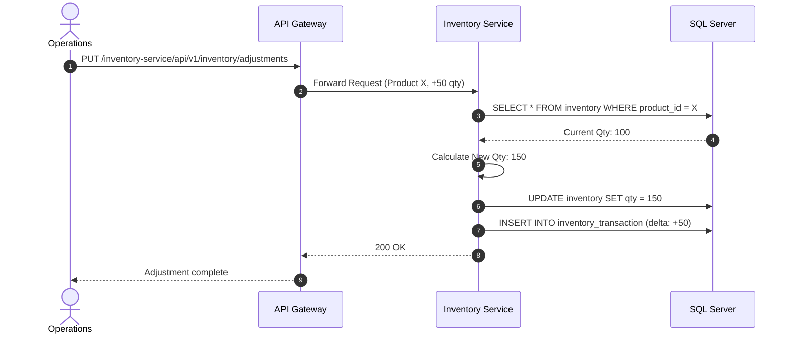

# Inventory Service

## Overview
The **Inventory Service** maintains the core definitions of physical products, SKU master data, product categorization, and overarching stock counts. It acts as the catalog engine for the warehouse operations.

## Tech Stack & Ports

| Technology/Category | Detail |
| :--- | :--- |
| **Framework** | Spring Boot |
| **Primary Database** | Microsoft SQL Server |
| **Default Port** | `8084` |
| **Data Access** | Spring Data JPA / Hibernate |

## Database Schema

Key entities powering the master catalog:

1. **`Product` & `ProductCategory`**: Contains the master records for all SKUs and their hierarchical categorizations.
2. **`Inventory`**: The aggregated stock levels for a given product across the enterprise.
3. **`InventoryTransaction`**: A log of quantity adjustments.
4. **`Warehouse` & `Location`**: Represents the physical storage zones.
5. **`Supplier`**: Master data for vendors providing the goods.

## Key API Endpoints

| Method | Path | Description |
| :--- | :--- | :--- |
| `GET` | `/api/v1/products` | Retrieve the product catalog. |
| `POST` | `/api/v1/products` | Append a new SKU to the master catalog. |
| `PUT` | `/api/v1/inventory/adjustments` | Manually adjust specific product quantities (Stock Adjustment). |
| `GET` | `/api/v1/inventory/transactions` | Fetch historical ledger of operations affecting stock levels. |

## Inter-service Interactions

:::info
**Current State**: Operates independently without utilizing `spring-cloud-starter-openfeign` or `spring-kafka`.
:::

- **Integration with WMS**: While tightly related to `wms-service` conceptually, they currently share data passively via the central SQL Server rather than pushing events natively through an event bus.

## Business Flow: Product Adjustment

