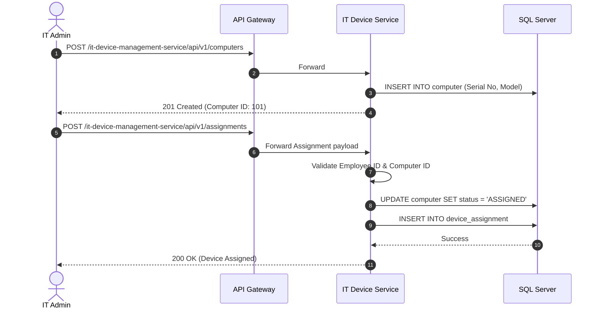

# IT Device Management Service

## Overview
The **IT Device Management Service** tracks computing hardware, peripheral assignments, IP ranges, and internal IT assets allocated to corporate employees.

## Tech Stack & Ports

| Technology/Category | Detail |
| :--- | :--- |
| **Framework** | Spring Boot |
| **Primary Database** | Microsoft SQL Server |
| **Default Port** | `8089` |
| **Data Access** | Spring Data JPA / Hibernate |

## Database Schema

Core entities related to IT infrastructure tracking:

1. **`Computer` & `Printer`**: Represents physical hardware assets (Laptops, Desktops, Network Printers).
2. **`DeviceAssignment`**: The mapping table linking an `Employee` to a specific hardware device.
3. **`IpRange`**: Tracks networking configuration and available corporate IP addresses.
4. **`ComputerChanges` / `PrinterChanges`**: Audit tables capturing the historical lifecycle and maintenance of devices.

## Key API Endpoints

This service uses standard HTTP semantics for internal IT tracking operations:

| Method | Path | Description |
| :--- | :--- | :--- |
| `GET` | `/api/v1/computers` | List all tracked corporate computers. |
| `POST` | `/api/v1/computers` | Register a new laptop/desktop into the system. |
| `POST` | `/api/v1/assignments` | Assign a specific `Computer` to an `Employee`. |
| `PUT` | `/api/v1/printers/{id}` | Update the status or IP of a network printer. |

## Inter-service Interactions

:::info
**Current State**: Uses standard API Gateway routing; no synchronous Feign clients or asynchronous Kafka queues are present in the codebase.
:::

- **Synchronous Interaction**: None directly with other backend services.
- **Asynchronous Interaction**: None via broker.

## Business Flow: Assigning a Laptop

