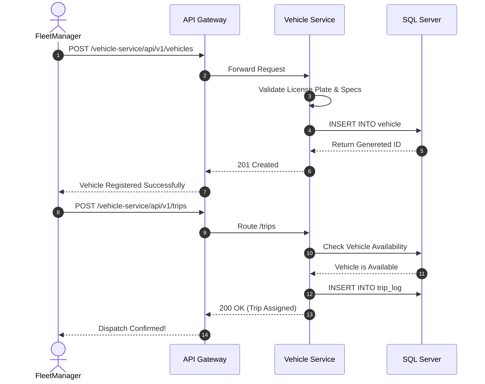

# Vehicle Service

## Overview
The **Vehicle Service** is responsible for managing the enterprise vehicle fleet, tracking logistics, driver assignments, and vehicle health/inspection statuses.

## Tech Stack & Ports

| Technology/Category | Detail |
| :--- | :--- |
| **Framework** | Spring Boot (`spring-boot-starter-web`) |
| **Primary Database** | Microsoft SQL Server |
| **Default Port** | `8083` |
| **Data Access** | Spring Data JPA / Hibernate |

## Database Schema

The service manages the following primary domain models (derived from `@Entity` classes):

1. **`Vehicle`**: Core entity representing a truck, car, or van. Key fields: `licensePlate`, `capacity`, `status`.
2. **`VehicleLog` / `Inspection`**: Tracks maintenance history and safety inspections.
3. **`Driver` / `User`**: Represents the personnel operating the vehicles.
4. **`PackingLot`**: Represents designated storage or parking zones for the vehicles.
5. **`OrderWarehouse` / `Supplier`**: Joins logistics paths showing where vehicles are dispatched.

## Key API Endpoints

The service utilizes a custom `@BaseApiV1RestController` annotation combining Spring's REST annotations. Standard CRUD operations are exposed:

| Method | Path | Description |
| :--- | :--- | :--- |
| `GET` | `/api/v1/vehicles` | Retrieve a paginated list of all enterprise vehicles. |
| `POST` | `/api/v1/vehicles` | Register a new vehicle to the fleet. |
| `GET` | `/api/v1/vehicles/{id}/inspections` | Fetch the inspection log for a specific vehicle. |
| `POST` | `/api/v1/trips` | Assign a vehicle and driver to a logistical trip. |

## Inter-service Interactions

:::info
**Current State**: The `vehicle-service` currently **does not** utilize `spring-cloud-starter-openfeign` for synchronous calls or `@KafkaListener` / `KafkaTemplate` for asynchronous event messaging.
:::

- **Synchronous**: Upstream routing is handled purely by the API Gateway. It does not actively call other microservices via Feign.
- **Asynchronous**: No RabbitMQ/Kafka dependencies are active. State changes rely on standard HTTP responses and shared persistent state in SQL Server.

## Business Flow: Vehicle Registration and Dispatch

