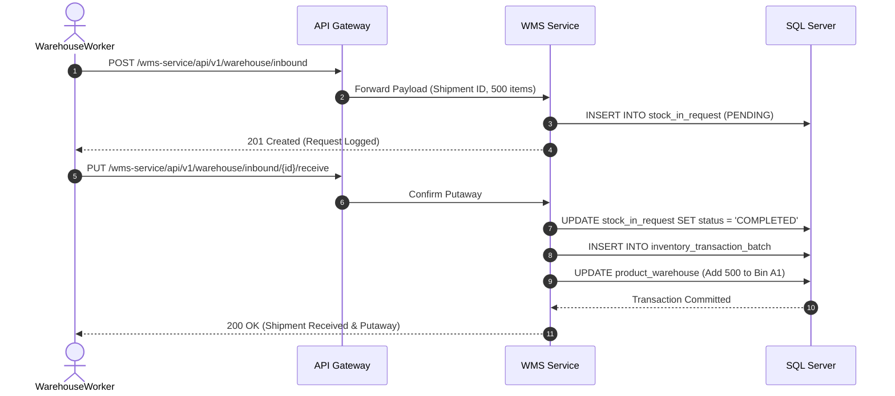

# WMS Service (Warehouse Management)

## Overview
The **WMS Service** orchestrates the physical movements of goods. It manages inbound receiving (`StockInRequest`), outbound picking/packing, and intra-warehouse transfers.

## Tech Stack & Ports

| Technology/Category | Detail |
| :--- | :--- |
| **Framework** | Spring Boot |
| **Primary Database** | Microsoft SQL Server |
| **Default Port** | `8085` |
| **Data Access** | Spring Data JPA / Hibernate |

## Database Schema

Whereas the Inventory Service holds the catalog, WMS handles the physical pipeline:

1. **`StockInRequest`**: Represents an inbound shipment waiting to be received and processed.
2. **`ProductWarehouse` & `Location`**: Tracks exactly which bins/racks contain which products.
3. **`InventoryTransferLog`**: Tracks movement of products between bins or warehouses.
4. **`InventoryTransactionBatch`**: Groups together multiple line-item movements during a single warehouse operation (like unloading a truck).

## Key API Endpoints

Using specific domain controllers (e.g., `WarehouseLocationController`, `WarehouseInventoryTransactionController`):

| Method | Path | Description |
| :--- | :--- | :--- |
| `POST` | `/api/v1/warehouse/inbound` | Create a new request to receive goods at the loading dock. |
| `PUT` | `/api/v1/warehouse/location/transfer` | Move products from an aisle/bin to another. |
| `GET` | `/api/v1/warehouse/dashboard` | Fetch KPI metrics for logistics center operations. |
| `POST` | `/api/v1/warehouse/upload` | Batch upload warehouse operational data via CSV/Excel. |

## Inter-service Interactions

:::tip
*Architectural Note*: In a fully modernized event-driven system, completing a `StockInRequest` in the WMS would trigger an asynchronous Kafka event. The `inventory-service` would consume this event to update global stock numbers. 

Presently, these services do not use Kafka or OpenFeign.
:::

## Business Flow: Receiving a Shipment

